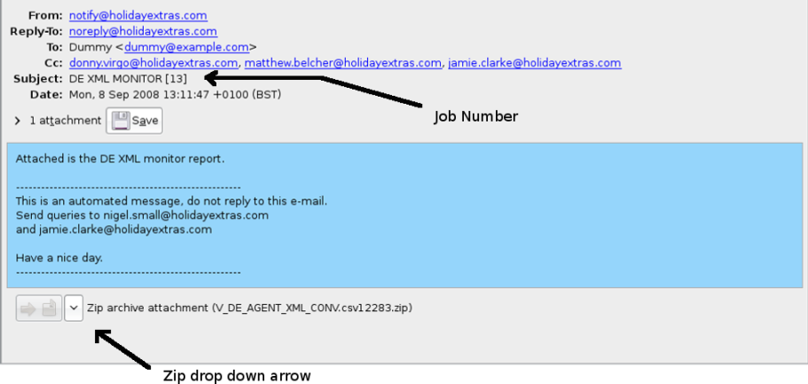

---

---

# E-mail notification system - Notification usage -

## Understanding emails (or "Why is my report not in the Excel format?")

### Opening attachments

Attachments to reports may be zip files which contain a compressed report. On most Operating Systems, these will be automatically decompressed when opened, but when using Mail.app on a Mac, attachments must be **right-clicked** and one of the save options chosen to get direct access to the contained report file.

Reports may come in one of two formats:

*  Comma separated values (CSV) (.csv file extension)

*  Tab separated values (TSV) (.tsv file extension)

Both of these formats are compatible with Microsoft Excel. However, if your computer is not configured to open a file with a ".tsv" extension in Excel, you must hold down the shift key and right-click the file, and then select **Open with -> Other**, select Excel from the list of programs, tick the box to **always open with** Excel when opening TSV files and click **OK**.

Excel may show an Import dialog when the file is opened. When opening a CSV file, ensure the **Comma** box is ticked and the **Tab** box is unticked, and vice versa for TSV files.

If Excel does not correctly separate the data into cells, it may have guessed at the file format based on the extension of the file. To force Excel to show the Import dialog, you can rename the file to have a ".txt" file extension, then re-open the file by using the same method as above. Beware that if you cannot see the file extension (the part of the file name after the full stop), you will need to prevent the Operating System from hiding this information before renaming the file. On Microsoft Windows (versions prior to Vista) this can be done with the following steps:

 1.  Open a file browser window (this can be done by holding down the Ctrl key and pressing E).
 2.  In the menu select **Tools -> Folder Options**.
 3.  Select the **View** tab.
 4.  In the list, ensure the "Hide extensions for known file types" item is unticked.
 5.  Click **OK**.

Click [here](http://www.wikihow.com/Disable-Hidden-File-Extensions-in-Windows-XP) for instructions on doing this on Microsoft Windows XP.

### How to report a problem

#### Apple Mail.app E-mail

 1.  When requesting help, remember to include the job number in square brackets in the subject line.
 2.  Reports appear below the message. To open a report, right-click and select one of the save options.

#### Evolution E-mail

## Usage Details

There is currently no interface for creating new e-mail notifications. Please contact your Account Manager and they can arrange report creation.
