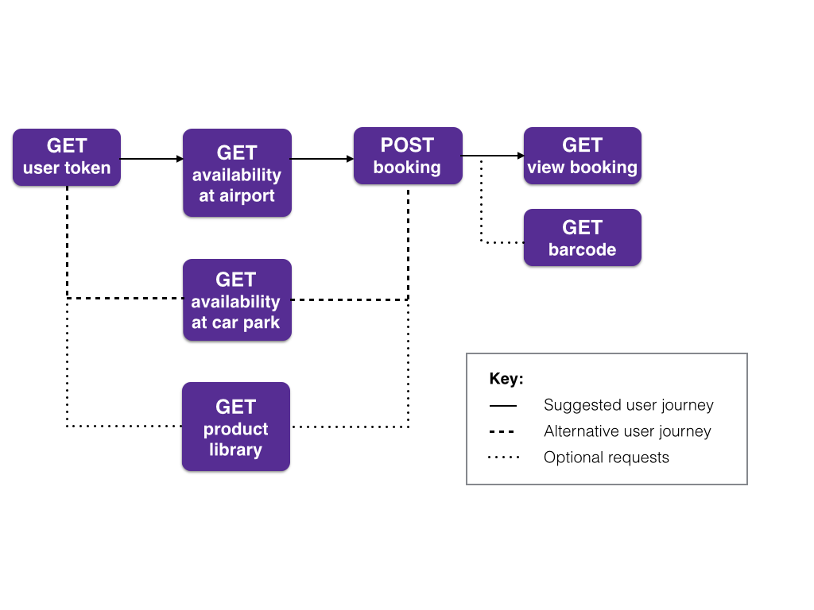

---

---

# Parking

[API Docs](/hxapi/) > product:[Parking](index)

## Parking Endpoints

Here are the car parking specific endpoints:

 | Request | Endpoint | Method |
 | ------ | -------- | ------ |
 | Availability at airport  | [https://api.holidayextras.co.uk/v1/carpark/AirportCode](av/airport)            | GET    |
 | Availability at car park | [https://api.holidayextras.co.uk/v1/carpark/CarParkCode](av/carpark)            | GET    |
 | Make booking at car park | [https://api.holidayextras.co.uk/v1/carpark/CarParkCode](bkg)                   | POST   |
 | Pre-booking price check  | [https://api.holidayextras.co.uk/v1/carpark/CarParkProductCode/priceCheck](priceCheck) | GET    |

## Parking User Journey

Below is a diagram detailing how the endpoints can be used to create a parking user journey. More information on each endpoint can be found in the detailed guides listed above.

 


## Parking Top Tips

We have put together these top tips, which detail how to optimise your use of our API for providing parking to your customers.

#### Merging Product Library data into availability response

To save sending a separate `https` request for information from the Product Library, you can specify a comma-separated list of values to pull this information back with the availability request.

Just specify a parameter named ``fields`` and include the Product Library field names there.

For example:

```
&fields=field_a,field_b,field_c
```

Alternatively, the method for querying the product library as a separate request [is outlined here](/hxapi/productlibrary/index).

#### Advance purchase

There is a field in the Product Library for car parks, named ``advance_purchase``. Advance purchase products are non-refundable and non-cancellable. As a result, the Cancellation Waiver must not be sold to customers purchasing a product with ``advance_purchase`` set to 1.

#### Request flags

The request flags brought back from availability searches indicate the fields required in the booking by the car park. You *must* retrieve this information from the customer at the time of booking.

There are occasions where your booking will go through without sending this information but can fail later when importing the bookings to car parks. This causes us considerable administrative difficulties and may result in your customer's booking being cancelled without notice.

#### Good to go meet and greet
New product types which are amendable by dates and times but cannot be cancelled.  The response will return `CanAmendCantCancel` set to either 1 or 0.
